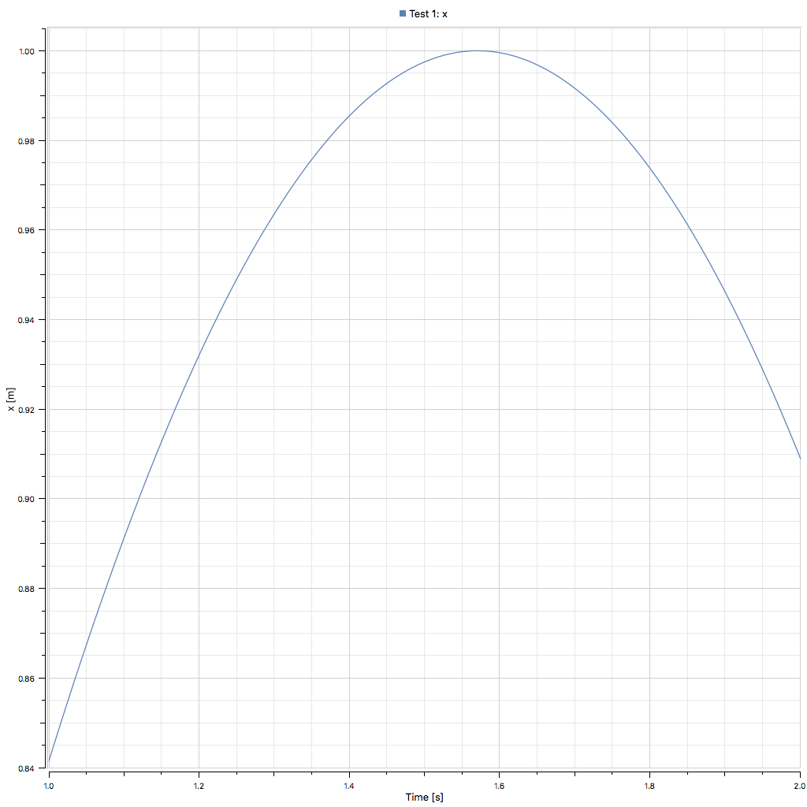
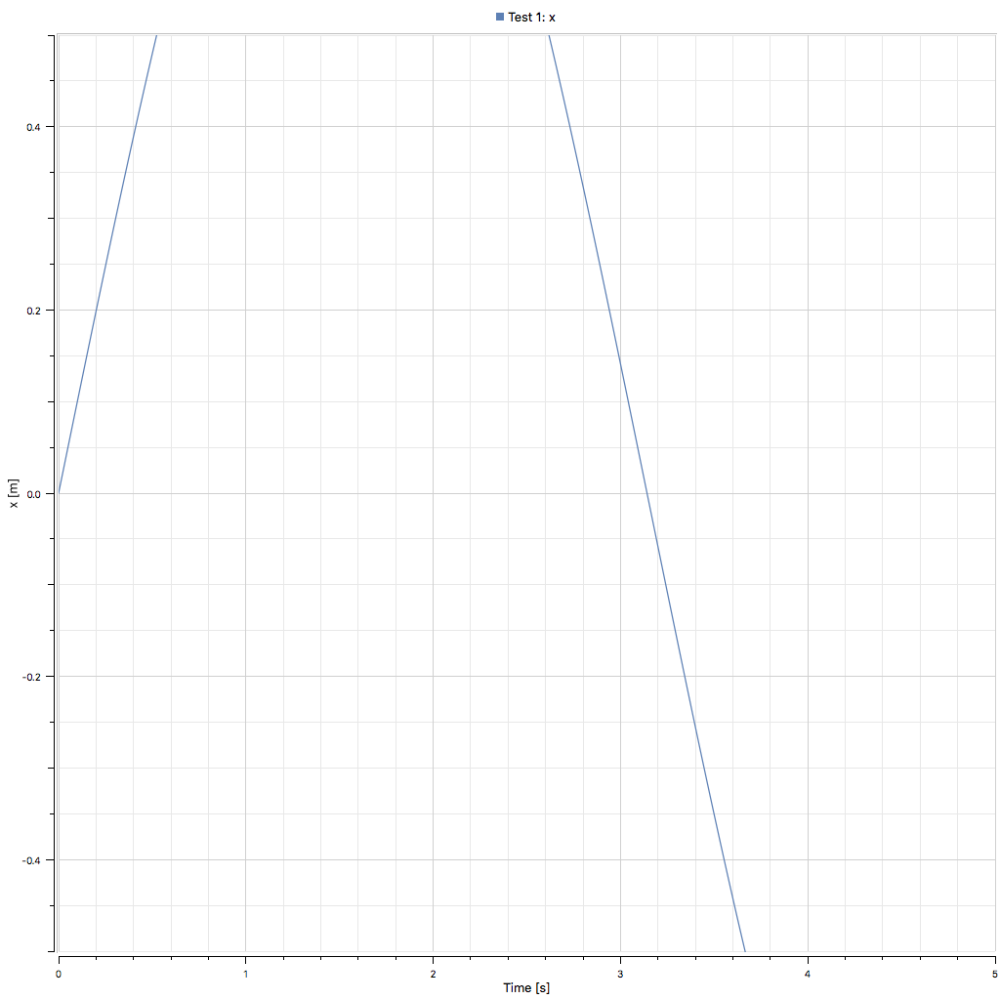
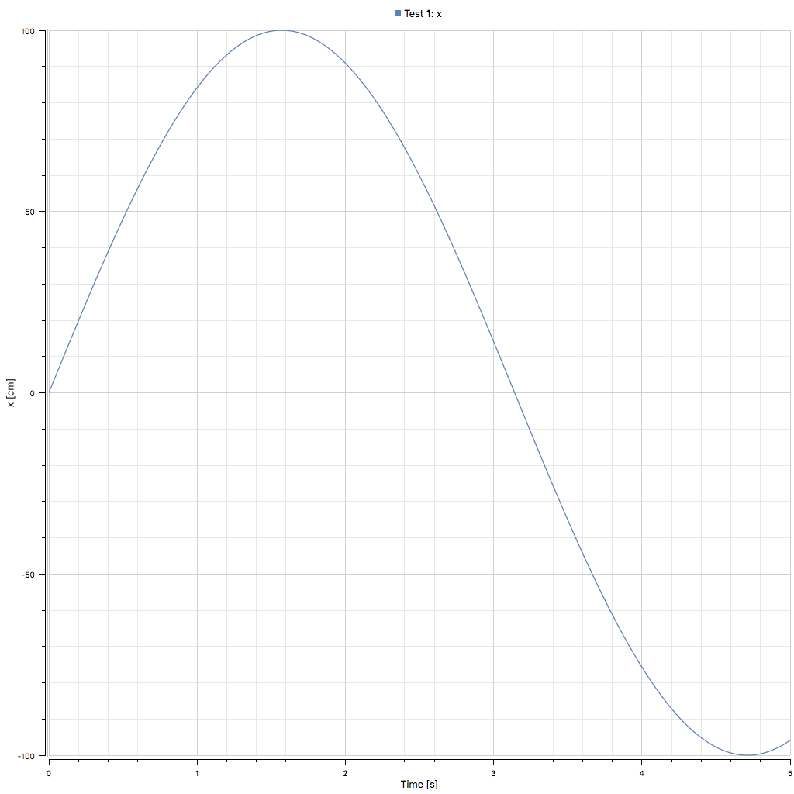
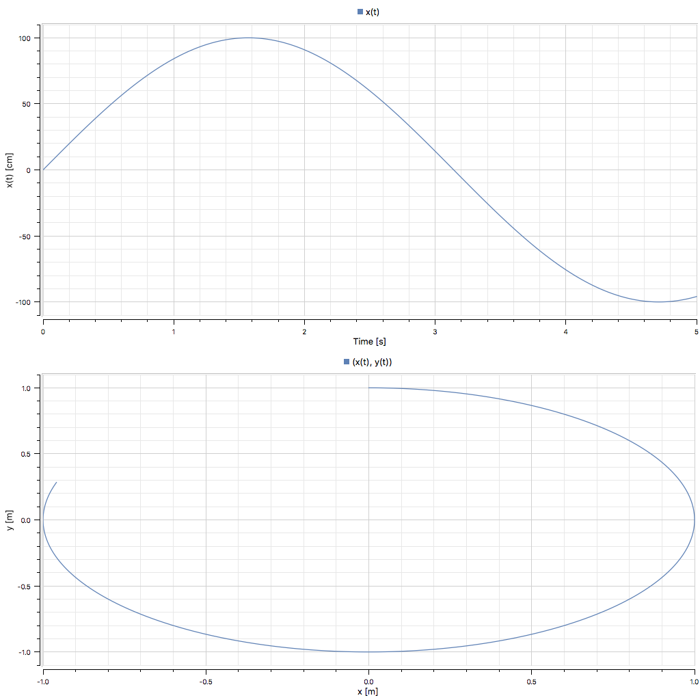
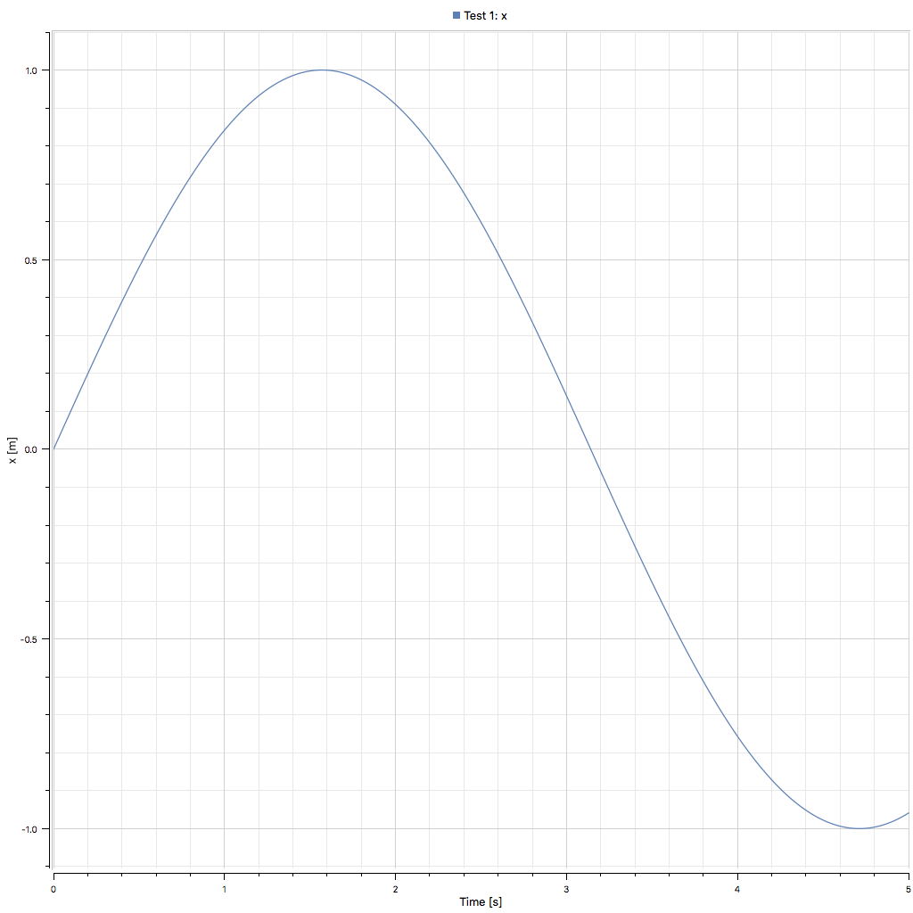
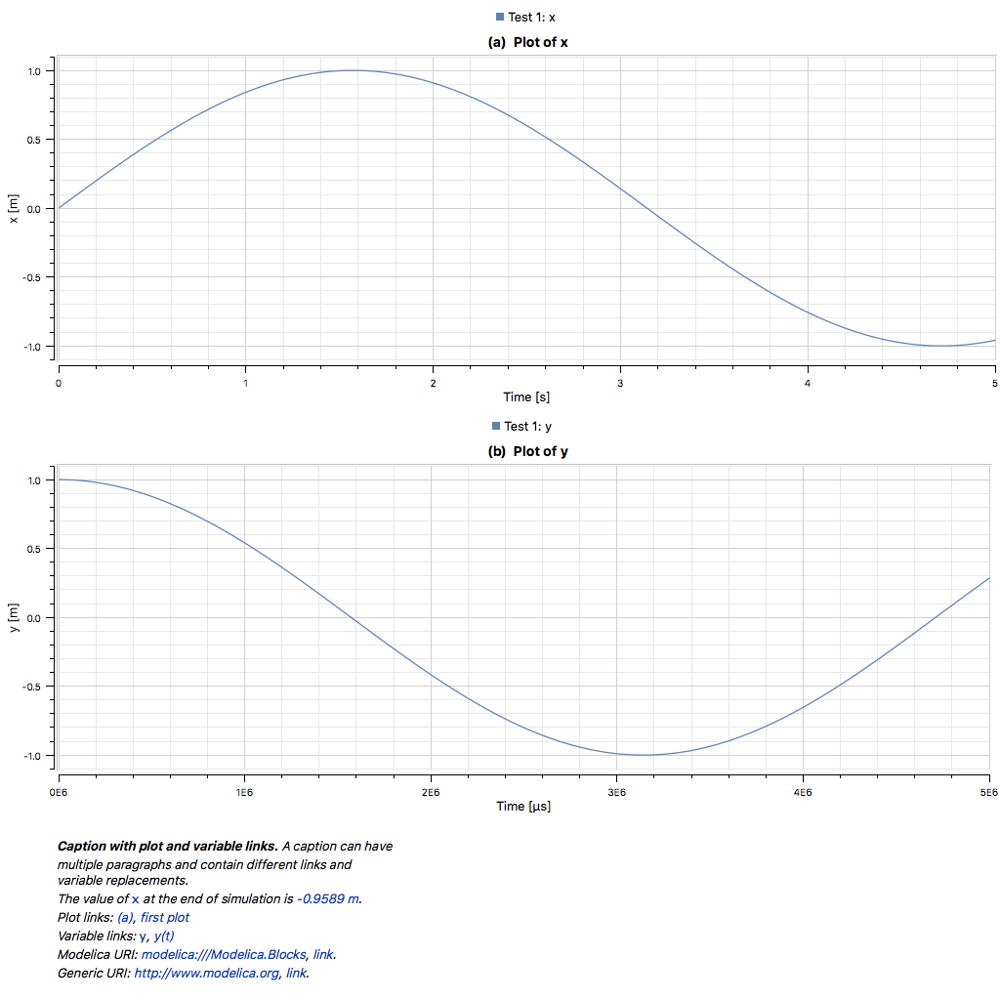
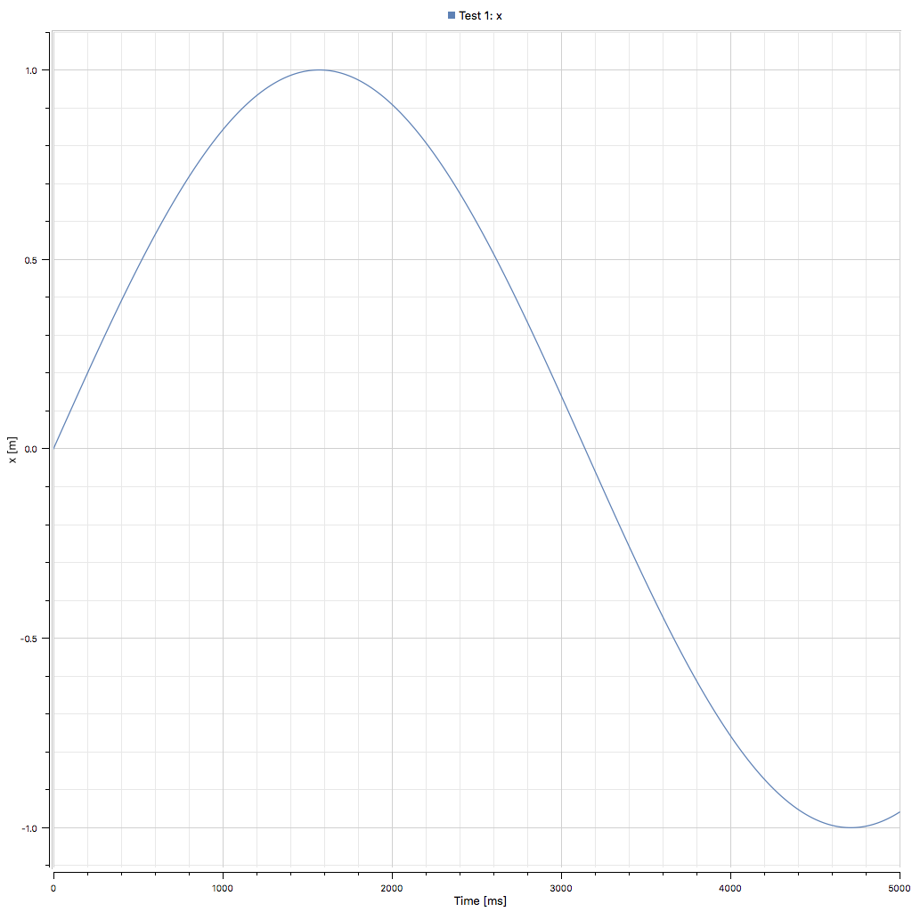

# MCP033 Examples
Examples of `Figure` annotations using the following model:
```
model Test
  Real x(start = 1, unit = "m") = sin(time);
  Real y(start = 1, unit = "m") = cos(time);
end Test;
```

```
Figure(
    title="Figure with no group",
    identifier="4afa9",
    plots={
        Plot(curves={Curve(y=x)})})
```


```
Figure(
    title="Different x-axis range",
    identifier="27b52",
    group="Multiple Plots",
    plots={
        Plot(curves={Curve(y=x)}),
        Plot(
            curves={Curve(y=y)},
            x=Axis(min=1000000, max=2000000, unit="us"))})
```


```
Figure(
    title="Fixed x-range",
    identifier="8d098",
    group="Axis",
    plots={
        Plot(
            curves={Curve(y=x)},
            x=Axis(min=1, max=2, unit="s"))}),
```

```
Figure(
    title="Fixed y-range",
    identifier="9335d",
    group="Axis",
    plots={
        Plot(
            curves={Curve(y=x)},
            y=Axis(min=-0.5, max=0.5, unit="m"))})
```


```
Figure(
    title="Fixed y-range with changed unit",
    identifier="719f3",
    group="Axis",
    plots={
        Plot(
            curves={Curve(y=x)},
            y=Axis(min=-100, max=100, unit="cm"))})
```


```
Figure(
    title="x(t) and (x(t), y(t))",
    identifier="03671",
    group="Multiple Plots",
    plots={
        Plot(curves={Curve(y=x, legend="x(t)")}),
        Plot(curves={Curve(x=x, y=y, legend="(x(t), y(t))")})})
```


```
Figure(
    title="Preferred plot",
    identifier="105c9",
    preferred=true,
    plots={
        Plot(curves={Curve(y=x)})})
```


```
Figure(
    title="Caption with plot and variable links",
    identifier="b014d",
    group="Multiple Plots",
    plots={
        Plot(
            title="Plot of x",
            identifier="plot-x",
            curves={Curve(y=x)}),
        Plot(
            title="Plot of y",
            identifier="plot-y",
            curves={Curve(y=y)},
            x=Axis(unit="us"))},
    caption="A caption can have\nmultiple paragraphs and contaidifferent links and variable replacements. \nThe value of(variable:x) at the end of simulation is %{x}.\nPlot links:(plot:plot-x), %[first plot](plot:plot-x)\n Variable links:(variable:y), %[y(t)](variable:y)\n Modelica URI: %(modelica:/Modelica.Blocks), %[link](modelica:///Modelica.Blocks).\nGeneriURI: %(http://www.modelica.org), %[link](http://www.modelica.org")
```


```
Figure(
    title="No legend",
    identifier="e8011",
    group="Multiple Plots",
    plots={
        Plot(
            title="Plot of x",
            identifier="plot-x",
            curves={Curve(y=x, legend="")}),
        Plot(
            title="Plot of y",
            identifier="plot-y",
            curves={Curve(y=y, legend="")})})
```


```
Figure(
    title="Autoscale x with changed unit",
    identifier="e1bbb",
    group="Axis",
    plots={
        Plot(
            curves={Curve(y=x)},
            x=Axis(unit="ms"))})
```


```
Figure(
    title="Another preferred plot",
    identifier="c52eb",
    preferred=true,
    plots={
        Plot(curves={Curve(y=x)})})
```

